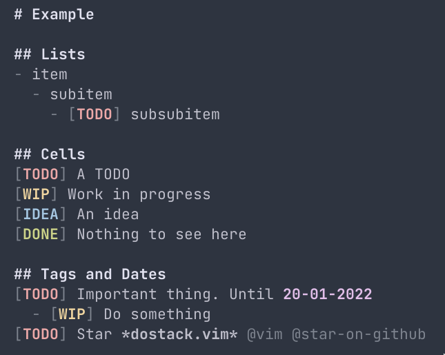

<h1 align="center">dostack.vim</h1>
<p align="center" >Syntax plugin for my TODO stack</p>

<p align="center">
    
</p>


Syntax for my TODO stack

## Highlighting groups
```
DoStackComment Comment
DoStackHeader1 gui=bold guifg=#e1e1ef
DoStackHeader2 doStackHeader1
DoStackHeader3 doStackHeader1
DoStackHeader4 doStackHeader1
DoStackHeader5 doStackHeader1
DoStackHeader6 doStackHeader1
DoStackUrl gui=underline guifg=#a3a3a8
DoStackTag guifg=#7e848f
DoStackImportant gui=bold,italic guifg=#e1bee9
DoStackStrong gui=bold
DoStackListMarker guifg=#7e848f
DoStackOrderedListMarker guifg=#7e848f 

"" Cell
DoStackTodo guifg=#eca8a8 gui=bold
DoStackDone guifg=#ccd389 gui=bold
DoStackIdea guifg=#a5c6e1 gui=bold
DoStackWip guifg=#efd5a0 gui=bold
DoStackDaily guifg=#c7ebe6 gui=bold
DoStackWeekly guifg=#c7ebe6 gui=bold
DoStackMonthly guifg=#c7ebe6 gui=bold
DoStackDate gui=bold guifg=#e1bee9
DoStackCell guifg=#7e848f
```
